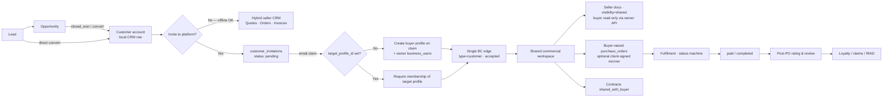
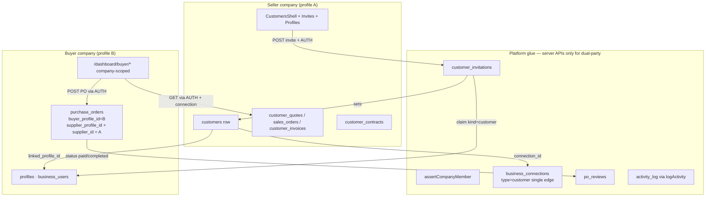
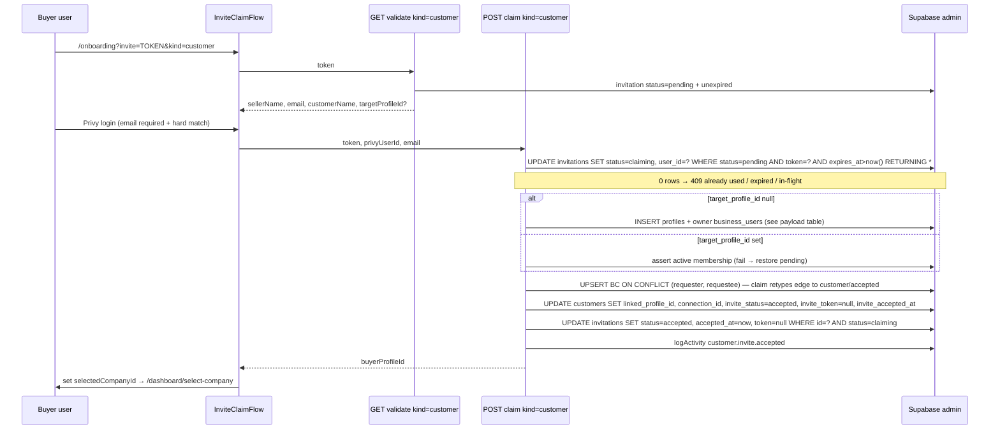
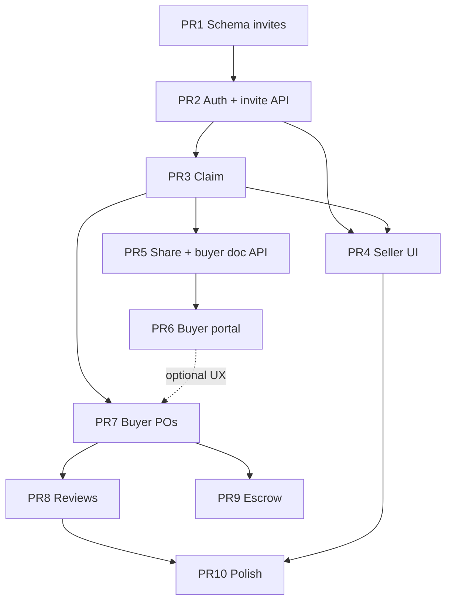

# Customer Platform Invitations & Connected CRM Lifecycle

| Field | Value |
|-------|--------|
| **Document title** | Revise Customer & CRM process to invite customers onto SupplierAdvisor |
| **Author** | TBD |
| **Date** | 2026-07-09 |
| **Status** | Draft (rev 4 — coherent suspend matrix + API catalog) |
| **Codebase** | `/workspaces/supplieradvisor-mvp` |
| **Related modules** | Customers CRM, Network connections, Procurement POs, POEscrowV2, Contractor portal (pattern reference) |

---

## Overview

SupplierAdvisor’s seller-side CRM today treats customers as **local master records** owned by the selling company (`customers.profile_id`). Commercial activity—quotes, sales orders, invoices, contracts, loyalty, claims, RIAD—lives entirely under that seller scope. The Invites page explicitly states that portal access must be granted via generic “network invite tools,” and commercial data stays local. That is the gap: buyers are not first-class platform participants.

This design **revises the end-to-end customer lifecycle** so inviting a customer onto the platform is a first-class stage—not a bolt-on. After claim/accept, the customer’s own company profile is linked to the seller’s CRM row via `linked_profile_id` + a single `business_connections` edge (`connection_type = 'customer'`, seller = requester, buyer = requestee). Connected buyers can raise POs (optional **client-signed** POEscrowV2), **read** shared commercial documents, use a company-scoped buyer portal, and leave post-PO ratings. **Unconnected (offline) customers remain fully valid** for seller-only quotes/orders/invoices (hybrid model).

**v1 buyer commercial actions** are intentionally scoped: raise POs, submit post-PO reviews, and **read** seller-shared docs. Quote acceptance and dual-party contract co-edit are **out of v1** (seller remains status owner).

---

## Background & Motivation

### Current state

| Surface | State today |
|---------|-------------|
| `customers` table | Seller-owned CRM; `linked_profile_id` exists in both `world_class_schema` CREATE and `crm_leads_opportunities` `sa_add_column` (idempotent dual path) but is **unused in app/TS** (`CustomerRecord` omits it) |
| Pill nav (`CustomersShell` `CUSTOMERS_NAV`) | Overview → Leads → Profiles → Add customer → Quotes → Orders → Invoices → Loyalty → Claims → Contracts → RIAD. **Neither Invites nor Portal** is in the pill nav |
| Sidebar customers sub | Overview…RIAD + **Portal** (`/dashboard/customers/portal`). **Invites not in sidebar** |
| `/dashboard/customers/invites` | **Route/stub only** (reachable from hub MODULES card): “create profile first, then use network invite tools…” |
| `/dashboard/customers/portal` | Seller ops board linking CRM modules—not buyer-facing |
| Rating field | `customers.rating` is an internal seller score (CRM POST), not peer review |
| Platform invites | Team, business/supplier (`profiles.invite_token` + `InviteClaimFlow`), contractor (`contractor_invites` + `/contractor/*`)—**no customer invite path** |
| PO raising (canonical UX) | **`app/dashboard/suppliers/po/page.tsx`**: insert `buyer_profile_id`, `supplier_id`, `total_amount`, `items`, `status: 'sent'`; optional client `writeContract` createPO/fund. Legacy `procurement/po/page.tsx` filters `status='approved'` / `requestee_id` (broken vs connections page) |
| CRM API auth | `companyId` from client only—**no** `business_users` membership check (same gap on contractor invite body `companyId`) |
| RLS | CRM tables `FOR ALL USING (true)` — open |
| Feature flags / activity_log writers | **No** existing feature-flag framework; `activity_log` table exists, **no** `app/api` writers found |

### Pain points

1. **Buyers cannot participate as platform counterparts.** They cannot raise POs against the inviting supplier, see seller-shared commercial documents, or leave post-PO reviews. (Quote accept / contract co-sign is a product desire but is **not v1**—see Goals.)
2. **Invites are disconnected from CRM.** Network/business invites create profiles without binding back to the seller’s `customers` row.
3. **Dual commercial rails are unbridged.** Seller CRM uses `sales_orders` / `customer_quotes` / `customer_invoices`; procurement uses `purchase_orders` between profiles.
4. **Reputation is incomplete.** `supplier_scorecards` (OTIFEF) exists; peer star/review after PO completion does not.
5. **Portal messaging is misleading.** “Customer portal” implies buyer self-service; it currently only serves the seller team.

### Why now

Contractor portal (`supabase/migrations/20260709_contractor_portal.sql`, `InviteContractorButton`, `/contractor/*`, `lib/contractor/access.ts`) proves a durable pattern: invite an external party tied to an existing local entity, claim after Privy auth, then open a scoped surface. Customer invitations reuse that operational model while binding into CRM + network + PO systems. **Unlike contractors**, buyers are full companies with `business_users` membership and company switcher—not user-operator-scoped entities.

---

## Goals & Non-Goals

### Goals

1. Make **Invite to platform** a first-class lifecycle stage after Customer account creation (or conversion from lead/opportunity).
2. Support invite of **new businesses** (profile created **on claim**) **and** **existing SupplierAdvisor profiles** (link via `target_profile_id` + membership check on claim).
3. On accept: link `customers` ↔ counterparty `profiles` + create/upsert **one** `business_connections` row with `connection_type = 'customer'`.
4. Enable connected buyers to: **raise POs** against the inviting supplier; **read** seller-shared contracts & commercial documents; use a **company-scoped** buyer portal; **rate/review after reviewable POs**.
5. Preserve **hybrid CRM**: offline customers continue to work for quotes/orders/invoices without invites.
6. **App-layer membership checks on every privileged route from day one** (PR 2), not deferred polish.
7. Reuse invite infrastructure: Resend (`lib/invites/email.ts`), expiry (`INVITE_EXPIRY_DAYS = 14`), claim validation patterns, Privy identity (`getCanonicalUserId`).

### Non-Goals (v1)

- Buyer **accept-quote** workflow or dual-party contract co-edit/e-sign (seller remains sole status owner; buyer is read-only on shared docs). Track as future PR.
- Replacing the entire CRM UI in one PR.
- Full multi-tenant RLS with Privy JWT claims (document path; app-layer + server-only buyer reads are the v1 control plane under open RLS).
- Buyer marketplace discovery of arbitrary suppliers (invite/relationship-scoped only).
- Migrating historical `sales_orders` into `purchase_orders`.
- Auto-bridging SO ↔ PO on accept (Open Question retained as non-goal).
- Multi-contact invites under one customer account (single primary email).
- Changing POEscrowV2 bytecode.
- Server-side funding of buyer escrow via platform private key.
- Supplier-inviting-suppliers or team invites.

---

## Proposed Design

### Lifecycle (revised)



### Relationship vs invitation status

**Do not conflate** invitation lifecycle with relationship phase. Two fields:

| Field | Source of truth for | Values (v1) |
|-------|---------------------|-------------|
| `customer_invitations.status` | A specific invite attempt | `pending` \| `claiming` \| `accepted` \| `declined` \| `expired` \| `revoked` |
| `customers.invite_status` | Denormalized relationship phase on CRM row | `not_invited` \| `invited` \| `accepted` \| `suspended` \| `declined` \| `expired` |

`claiming` is a short-lived lock during claim processing (see Claim sequence); validate and list UIs treat only `pending` as inviteable; stuck `claiming` older than 5 minutes may be reaped back to `pending` by the expiry job.

**Dropped from v1:** `invite_status = active` (no derivation rule). UI “Connected” badge = `invite_status = accepted` (and connection not suspended).

**Do not confuse** with `customers.status` (account operational: active/inactive/prospect/on_hold)—unchanged.

| `invite_status` | Meaning | Set when |
|-----------------|---------|----------|
| `not_invited` | Default offline CRM | Create customer; after revoke with no pending invite |
| `invited` | Outstanding pending invitation | Invite send / resend |
| `accepted` | Claimed; collaboration enabled | Successful claim |
| `suspended` | Seller paused collaboration | Seller suspend action |
| `declined` | Invitee declined | Decline endpoint |
| `expired` | Last invite expired unclaimed | Expiry job or resend pre-check |

#### Suspend semantics (single coherent matrix)

When seller suspends:

1. Set `customers.invite_status = 'suspended'`.
2. Set `business_connections.metadata.suspended = true` (and `metadata.suspended_at`). **Do not** flip connection `status` to `declined` (keeps accepted history; connections UI enum remains `pending|accepted|declined`).
3. Unsuspend: clear `metadata.suspended` / `suspended_at`, set `invite_status = accepted`.

**Authoritative capability matrix while `status='accepted'` and `metadata.suspended=true`:**

| Capability | Suspended? | Helper / filter |
|------------|------------|-----------------|
| List supplier/customer in portal or workspace | **Yes — show with Suspended badge** | `assertCustomerConnection(..., { allowSuspended: true })` — **do not** filter suspended out of list queries |
| Buyer read already-shared docs | **Yes** | Same; then `visibility=shared` / `shared_with_buyer` |
| Seller read own CRM + historical shares | **Yes** | Seller membership only |
| Seller mark **new** doc/contract shared | **No → 409** | Share PATCH checks suspended |
| Buyer raise new PO | **No → 403** | `assertCustomerConnection(..., { allowSuspended: false })` (default) |
| Seller progress existing PO status | **Yes** | Supplier membership on PO |
| Buyer submit review on reviewable PO | **Yes** | PO ownership + `PO_REVIEWABLE_STATUSES` (no active-connection required) |
| New invites / re-invite while linked | **No → 409** (see re-invite table) | Invite API |

**Rule of thumb:** suspend freezes **new commercial collaboration** (POs, new shares); it does **not** erase history (list, shared reads, reviews, open PO lifecycle).

#### Re-invite transitions

| From | Action | Result |
|------|--------|--------|
| `expired` / `declined` / `not_invited` | Send invite | New invitation row; `invite_status=invited` |
| `invited` | Resend | Revoke prior `pending` for that customer; new token; stay `invited` |
| `accepted` / `suspended` with live link | Send invite | **409** unless unlink/suspend-first product path |
| `suspended` | Unsuspend | Back to `accepted` (no new invite needed) |

Derived badge: **Offline** (`not_invited` \| `expired` \| `declined`) | **Pending invite** (`invited`) | **Connected** (`accepted`) | **Suspended** (`suspended`).

### Architecture



### Analogous pattern: contractor portal

| Concern | Contractor | Customer (proposed) |
|---------|------------|---------------------|
| Local entity | `container_contractors` | `customers` |
| Invite table | `contractor_invites` | `customer_invitations` |
| Token | UUID + UNIQUE | UUID + UNIQUE (required) |
| Claim route | Dedicated `/api/containers/contractor-invite/accept` | **Extend** `/api/invites/*` with `kind=customer` (no legal contract step; see Alternatives) |
| Portal | `/contractor/*` **user-operator-scoped** (`user_id` on contractor) | `/dashboard/buyer/*` **company-scoped** (selected company + `business_users` membership)—like CRM, not contractor |
| Access helper | `assertContractorContainerAccess` | `assertCompanyMember` + `assertCustomerConnection` |
| Side effect of accept | `user_id`, `portal_status=active` | `linked_profile_id`, `connection_id`, `invite_status=accepted`, single BC row |

### Invite flows (decided)

#### Profile policy: create-on-claim (Key Decision 11)

At **invite send** time:

1. Write only `customer_invitations` (+ denormalize `customers.invite_status=invited`, `invited_at`, `invited_email`, optional latest `invite_token`).
2. **Do not** create a skeleton `profiles` row (differs from `invite-business`, which always inserts a profile).
3. Lookup `profiles` by normalized email:
   - **0 matches:** `target_profile_id = null` → claim will create profile.
   - **1 match:** set `target_profile_id` on invitation.
   - **Multiple matches:** leave `target_profile_id` null; on claim prefer profile where user is already an active member; if none, create new profile (log warning). Do not auto-pick arbitrarily.

#### A. Invite (new or existing email)

1. Seller CTA → `POST /api/customers/invites` with `{ companyId, customerId, privyUserId, email?, message? }`.
2. **`assertCompanyMember(privyUserId, companyId)`** — required.
3. Customer must have `profile_id === companyId`; email required.
4. Rate limits (see Security).
5. Revoke prior `pending` invites for same `customer_id`.
6. Insert invitation; email via Resend; return link if email fails.

#### B. Existing profile on claim

1. If `target_profile_id` set (or resolved by email at claim time): claimer must be **active** `business_users` of that profile **or** become owner only when creating a **new** profile.
2. If claimer’s session email matches invitation but they are **not** a member of the target company: **403** with message to ask an admin of that company to accept, or use an email that is not already a company.
3. If already connected (`customers.linked_profile_id` for this seller already equals that profile, or accepted BC exists): **409**.

#### C. Claim sequence (race-safe, non-burning on partial failure)

**Chosen order: intermediate `claiming` lock → side effects → final `accepted`.** Never mark `accepted` until profile/BC/customer succeed. On failure after lock, restore `pending` so the token remains usable.



**BC UPSERT / retype (intentional — Key Decision 24):** unique key is directed pair only `(requester_profile_id, requestee_profile_id)`, not `connection_type`. On conflict, claim **wins** and sets `connection_type='customer'`, `status='accepted'`, `responded_at=now`. If a prior `partner` (or other) edge existed for the same directed pair, preserve previous type in `metadata.prior_connection_type` and log `customer.connection.retyped`. This matches single-edge Option A (one row per directed pair). Do **not** use unique `(requester, requestee, connection_type)` in v1 (would create dual edges and break Option A queries).

**Failure / compensation (same request):**

| Failure point | Action |
|---------------|--------|
| Membership 403 after `claiming` | `UPDATE invitations SET status='pending', user_id=null WHERE id AND status='claiming'`; return 403 |
| Profile insert fails | Restore invitation to `pending`; return 500 |
| BC upsert fails | Restore invitation to `pending`; if profile was created in this request, soft-delete or leave orphan with `metadata.claim_orphaned=true` (prefer delete if no other memberships); return 500 |
| Customer update fails | Same restore + compensate profile/BC if created this request; return 500 |
| Final `claiming→accepted` fails (0 rows) | Rare race; treat as 409; do not leave CRM half-linked without accepted invite—retry-safe if customer already linked |

Optional stronger form (nice-to-have): single Postgres RPC/`SECURITY DEFINER` function wrapping steps in one transaction. v1 app-layer ordered updates + restore is required; RPC is optional hardening.

**Hard email rule for `kind=customer`:** session must have a verifiable email and it **must** equal invitation email (case-insensitive). Missing email → **403** (“Sign in with the invited email”). Stricter than team/business soft-match because this attaches commercial relationships.

**Tokens cleared only on final accept:** null `customer_invitations.token` and `customers.invite_token` only in the final `claiming→accepted` step (or together with customer update after side effects succeed). During `claiming`, token remains so restore works.

**Uniqueness (required, not optional):**

- `customer_invitations.token` UNIQUE
- **`UNIQUE (requester_profile_id, requestee_profile_id)` on `business_connections`** — required in **PR 1** as upsert conflict target. Claim retypes existing partner/pending edges to `customer`/`accepted` (see BC UPSERT note). If historical duplicates exist, one-time cleanup: keep lowest `id` per pair before creating the index.
- Partial unique: `customers (profile_id, linked_profile_id) WHERE linked_profile_id IS NOT NULL` → **1:1 seller CRM row ↔ linked buyer company**

#### Create-on-claim insert payloads (when `target_profile_id` is null)

Mirror `app/api/onboarding/register-business/route.ts` + business claim ownership fields. Defaults come from the CRM `customers` row + invitation + claim body.

**`profiles` insert:**

| Column | Value |
|--------|--------|
| `trading_name` | `customers.trading_name` or invitation `customer_name` |
| `legal_name` | `customers.legal_name` or same as trading_name |
| `email` | invitation email (normalized) |
| `contact_name` | claim `name` or `customers.contact_name` or invitation `full_name` |
| `contact_phone` | claim `phone` or `customers.phone` |
| `website` | `customers.website` |
| `industry` | `customers.industry` |
| `city` / `country` / region | from customer when present; country default `South Africa` if used elsewhere |
| `relationship_type` | `'customer'` (buyer-side company on this platform) |
| `supplier_status` | `'active'` |
| `user_id` | claimer canonical Privy id |
| `claimed_at` | now |
| `created_at` | now |
| `onboarding_complete` | **`false`** — claimer is sent through company select; optional full wizard later (minimal usable company for switcher) |
| `metadata` | `{ source: 'customer_invite', invitation_id, seller_profile_id }` |

Do **not** set `invite_token` on the new profile (customer invite lives on `customer_invitations`, not profile-token claim).

**`business_users` insert (owner):**

| Column | Value |
|--------|--------|
| `user_id` | claimer Privy id |
| `profile_id` | new profile id |
| `role` | `'owner'` |
| `status` | `'active'` |
| `name` | contact_name |
| `email` | invitation email |
| `joined_at` | now |
| `created_at` | now |

When `target_profile_id` is set: **no** profile insert; require existing active membership; do not promote to owner.

### Connected capabilities

#### 1. Connection graph query (Option A — single edge)

On claim create **exactly one** edge:

```ts
{
  requester_profile_id: sellerProfileId,  // inviter
  requestee_profile_id: buyerProfileId,   // customer company
  status: 'accepted',
  connection_type: 'customer',
  responded_at: now,
  metadata: { customer_id, invitation_id, suspended: false }
}
```

**Buyer “my suppliers” / workspace** (`GET /api/buyer/workspace`) — **include suspended** (badge in UI):

```sql
-- conceptual — list / hub (allowSuspended: true)
SELECT * FROM business_connections
WHERE requestee_profile_id = :buyerCompanyId
  AND connection_type = 'customer'
  AND status = 'accepted';
-- supplier profile = requester_profile_id
-- UI: if COALESCE((metadata->>'suspended')::boolean, false) then badge "Suspended", disable Raise PO
```

**Buyer PO eligibility** — **exclude suspended**:

```sql
-- same as list plus:
AND COALESCE((metadata->>'suspended')::boolean, false) = false;
```

`supplierProfileId` must equal `requester_profile_id` of such a row. **Do not** OR `connection_type in ('partner','supplier')` for invite-scoped customer POs.

**Seller “my connected customers”** — include suspended (badge in CRM):

```sql
WHERE requester_profile_id = :sellerCompanyId
  AND connection_type = 'customer'
  AND status = 'accepted';
-- expose metadata.suspended for Suspended badge; block new-share UI when true
```

No reverse edge in v1.

#### 2. Raise POs against inviting supplier

**Canonical off-chain UX reference:** `app/dashboard/suppliers/po/page.tsx` (not legacy `procurement/po`).

##### Off-chain PO status machine (app)

| Status | Meaning | Who sets |
|--------|---------|----------|
| `draft` | Local draft (optional; buyer API may skip) | Buyer |
| `sent` | Submitted to supplier | Buyer on create (default) |
| `accepted` | Supplier accepted | Seller |
| `funded` | Off-chain: payment pledged / on-chain Funded mirrored | Buyer or system after chain fund |
| `paid` | Settled off-chain or funds released | Seller or system |
| `completed` | Fully closed (optional alias after paid + delivery) | Seller |
| `cancelled` | Cancelled | Either with rules |

Constants live in `lib/procurement/types.ts` (created in **PR 7**):

```ts
export const PO_STATUSES = [
  'draft', 'sent', 'accepted', 'funded', 'paid', 'completed', 'cancelled',
] as const;

/** Statuses that unlock POST /api/buyer/reviews */
export const PO_REVIEWABLE_STATUSES = ['paid', 'completed'] as const;

/** Allowed seller transitions for inbound customer-portal POs */
export const SELLER_PO_TRANSITIONS: Record<string, string[]> = {
  sent: ['accepted', 'cancelled'],
  accepted: ['paid', 'completed', 'cancelled'], // paid or completed both unlock reviews
  funded: ['paid', 'completed', 'cancelled'],
  paid: ['completed'],
};
```

**On-chain (POEscrowV2)** is separate: `Created(0) → Funded(1) → Delivered(2) → Completed(3) | Cancelled(4)`. Map loosely: createPO → keep/set app `sent`/`funded`; fundPO → `funded`; release → `paid`/`completed`. Never gate reviews only on chain enum.

##### Seller status path (required for reviews to unlock)

Buyer create alone leaves POs at `sent`. **PR 7 must ship a seller transition API and Inbound POs actions**—otherwise reviews never become reachable.

`PATCH /api/customers/purchase-orders` (seller-scoped):

```ts
// Request
{ companyId: number; privyUserId: string; id: number; status: 'accepted' | 'paid' | 'completed' | 'cancelled' }

// AuthZ
// 1. assertCompanyMember(privyUserId, companyId)
// 2. Load PO; require (po.supplier_profile_id === companyId || po.supplier_id === companyId)
// 3. Allow only SELLER_PO_TRANSITIONS[po.status] includes body.status
// 4. Set updated_at; if paid/completed set closed_at when column exists
```

UI: Customers → Orders → **Inbound POs** list with Accept / Mark paid / Complete / Cancel. **Do not** rely on open-RLS client `update` as the long-term path even if it works today—server PATCH is the intended control plane.

Buyer may cancel own `draft`/`sent` via `PATCH /api/buyer/purchase-orders` with symmetric buyer ownership checks (optional thin addition in PR 7).

##### Buyer PO insert payload (server)

`POST /api/buyer/purchase-orders` after `assertCompanyMember` + `assertCustomerConnection(buyer, supplier, { allowSuspended: false })`:

```ts
// Request body
{
  buyerCompanyId: number;
  supplierProfileId: number;
  privyUserId: string;
  description?: string;
  currency?: string;           // default ZAR
  payment_terms?: string;
  incoterms?: string;
  promised_date?: string;
  items: Array<{
    product_id?: number | null;
    item_name: string;         // align suppliers/po LineItem naming
    quantity: number;
    unit_price: number;
    uom?: string | null;
  }>;
  useEscrow?: boolean;         // client will sign separately; server only records intent
}

// Insert (compat with both world_class + suppliers/po)
{
  buyer_profile_id: buyerCompanyId,
  supplier_profile_id: supplierProfileId,
  supplier_id: supplierProfileId,       // legacy column still written by suppliers/po
  total_amount: computedSum,            // sum qty * unit_price — ensure column exists (PO PR migration)
  subtotal: computedSum,                // world_class adds subtotal
  currency: body.currency || 'ZAR',
  description: body.description || null,
  items: normalizedItems,
  status: 'sent',
  payment_terms: body.payment_terms || null,
  incoterms: body.incoterms || null,
  promised_date: body.promised_date || null,
  seller_customer_id: resolvedCustomerId, // see below
  source: 'customer_portal',
  metadata: { invitation_connection: true },
  created_at / updated_at: now
}
```

**Column note:** `20260709_world_class_schema.sql` adds `subtotal` (and tax/shipping/discount) but **does not** `sa_add_column` `total_amount`. Live `suppliers/po` already writes `total_amount` (pre-existing deployed column). **PO PR migration must** `sa_add_column('purchase_orders', 'total_amount', 'numeric(18,2)', '0')` so greenfield applies succeed. Always write **both** `total_amount` and `subtotal` to the same computed sum when both columns exist.

**`seller_customer_id` resolution:**

```sql
SELECT id FROM customers
WHERE profile_id = :supplierProfileId
  AND linked_profile_id = :buyerCompanyId
  AND invite_status IN ('accepted', 'suspended')
ORDER BY id ASC
LIMIT 1;
```

If zero rows: leave null (PO still valid; seller bridge may show under “unmatched”). If multiple (before unique index): lowest `id`, log warning. Partial unique index prevents multiples going forward.

Seller inbound list: `purchase_orders` where `supplier_profile_id = me OR supplier_id = me`, optionally join `seller_customer_id`.

#### 3. Shared contracts & documents — access model (open RLS)

Column flags (`visibility`, `shared_with_buyer`) are **authorization attributes**, not security boundaries.

**Under open RLS, flags alone do not stop a client from `select *`.** Therefore:

1. **Buyer portal must never** query `customer_quotes` / `sales_orders` / `customer_invoices` / `customer_contracts` via the browser Supabase anon client.
2. **All buyer document access** goes through server routes using service-role / server client **after** membership + connection + ownership + visibility checks.
3. Seller CRM UI may continue direct client access (existing pattern) until RLS is tightened—but **new dual-party features** are API-only for the buyer side.
4. True isolation requires future RLS; v1 documents this honestly.

##### Buyer document GET contract

`GET /api/buyer/documents?buyerCompanyId=&privyUserId=&type=quote|order|invoice|contract&supplierProfileId?=`

AuthZ (all required):

1. `assertCompanyMember(privyUserId, buyerCompanyId)`
2. For each candidate supplier: accepted customer-type connection (`requestee=buyer`, `requester=supplier`, `type=customer`) — **`allowSuspended: true`** (historical shared docs remain readable after suspend)
3. Doc `profile_id` (seller) = that supplier
4. Doc `visibility = 'shared'` **or** contract `shared_with_buyer = true`
5. Optional filter `seller_customer_id` / customer_id linked to buyer

Return sanitized fields (no internal seller notes if product wants—default include notes for v1 transparency between parties). Response may include `connectionSuspended: true` so UI can show read-only banner.

##### Seller share toggle

`PATCH` existing docs/contracts APIs:

1. `assertCompanyMember(privyUserId, companyId)` — seller only.
2. Only seller may set `visibility=shared` / `shared_with_buyer=true` and set `buyer_profile_id` / `shared_at`.
3. **When setting share=true (new share):** resolve linked customer / BC for that buyer (`customers.profile_id=companyId` and `customer_id` or `linked_profile_id` / connection). If `customers.invite_status='suspended'` **or** BC `metadata.suspended=true`, return **409** `"Connection suspended — cannot share new documents. Unsuspend first."`
4. Unsharing (`visibility=seller_only` / `shared_with_buyer=false`) remains allowed while suspended (seller can tighten access).

#### 4. Buyer portal experience

**Company-scoped** (user selects buyer company via existing company switcher). Not contractor-style user_id binding.

| Route | Purpose |
|-------|---------|
| `/dashboard/buyer` | Hub: connected suppliers (**include suspended** with badge), open POs, pending reviews |
| `/dashboard/buyer/suppliers` | List accepted customer-type connections including suspended; Raise PO disabled when suspended |
| `/dashboard/buyer/pos` | Raise / list POs (create blocked if supplier connection suspended) |
| `/dashboard/buyer/documents` | Shared quotes, orders, invoices, contracts (**API only**; works when suspended) |
| `/dashboard/buyer/reviews` | Pending + history (works when suspended if PO reviewable) |

Seller `/dashboard/customers/portal`: rename copy to **Connected customers ops board**.

#### 5. Post-PO rating & review

Unlock when `purchase_orders.status ∈ PO_REVIEWABLE_STATUSES` (`paid`, `completed`).

**AuthZ for `POST /api/buyer/reviews`:**

1. Body: `{ buyerCompanyId, privyUserId, purchaseOrderId, rating, title?, body?, dimensions? }` — **no client-supplied `reviewerProfileId` / `revieweeProfileId`**.
2. `assertCompanyMember(privyUserId, buyerCompanyId)`.
3. Load PO; require `po.buyer_profile_id === buyerCompanyId`.
4. Require status in `PO_REVIEWABLE_STATUSES`.
5. Set `reviewer_profile_id = buyerCompanyId`, `reviewee_profile_id = po.supplier_profile_id || po.supplier_id`.
6. **Suspend does not block reviews:** if PO is reviewable and buyer/supplier match, allow submit even when connection `metadata.suspended` is true (same rule as Suspend semantics + hybrid table).
7. Unique `(purchase_order_id, reviewer_profile_id)` → 409 on duplicate.
8. **Visibility v1: bilateral only** (buyer + seller companies). Not on public supplier profile. Aggregates on seller CRM / performance UI for parties only.

Seller moderation: `PATCH /api/customers/reviews` with `status=hidden` (seller member of reviewee company only). Out of scope: public dispute flow.

Seller `customers.rating` remains internal; surface peer avg separately.

### Hybrid offline model + progressive connect / suspend

| Capability | Offline | Connected | Suspended connection |
|------------|---------|-----------|----------------------|
| Seller quotes/SO/invoices | Yes | Yes | Yes (seller) |
| Share doc to buyer | N/A | Yes | No new shares; existing shares stay |
| Buyer read shared docs | No | Yes (API) | Yes historical |
| Buyer-raised PO | No | Yes | **Blocked** |
| New peer review | No | If PO reviewable | **Allowed** if PO already `paid`/`completed` (not blocked by suspend) |
| Buyer portal list supplier | No | Yes | Shown as Suspended (read-only; no new PO) |

**Progressive connect:** when an offline customer later connects, existing quotes/orders/invoices remain `visibility=seller_only` until the seller explicitly shares. No bulk rewrite.

**Open POs after suspend:** remain in DB; buyer cannot create new; seller progresses status via `PATCH /api/customers/purchase-orders`; **reviews allowed** for already-reviewable POs (not blocked by suspend).

---

## API / Interface Changes

### Auth helpers (ship in PR 2 — not PR 10)

`lib/customers/access.ts` (or `lib/auth/company-access.ts`):

```ts
/** Active business_users row for user + company */
export async function assertCompanyMember(
  privyUserId: string | null | undefined,
  companyId: number
): Promise<{ ok: true; userId: string } | { ok: false; error: string; status: number }>;

/**
 * Accepted customer-type connection; seller is requester, buyer is requestee.
 * @param opts.allowSuspended default false — set true for list, historical doc read;
 *   false for new PO create (and any “new collaboration”).
 * Returns connection incl. suspended flag for UI.
 */
export async function assertCustomerConnection(
  buyerCompanyId: number,
  supplierCompanyId: number,
  opts?: { allowSuspended?: boolean }
): Promise<
  | { ok: true; connection: { id: number; suspended: boolean; /* ... */ } }
  | { ok: false; error: string; status: number }
>;

/** Seller side: customer row + BC for companyId; used by share PATCH */
export async function assertSellerCustomerNotSuspended(
  sellerCompanyId: number,
  customerId: number
): Promise<{ ok: true } | { ok: false; error: string; status: 409 }>;

export async function logActivity(entry: {
  profile_id: number;
  actor_user_id?: string | null;
  action: string;
  entity_type?: string;
  entity_id?: string;
  summary: string;
  metadata?: Record<string, unknown>;
}): Promise<void>;
```

`logActivity` inserts into `activity_log` (`profile_id`, `actor_user_id`, `action`, `entity_type`, `entity_id`, `summary`, `metadata`, `created_at`). Failures soft-log to console (do not fail primary request).

Sample:

```ts
await logActivity({
  profile_id: sellerCompanyId,
  actor_user_id: userId,
  action: 'customer.invite.sent',
  entity_type: 'customer',
  entity_id: String(customerId),
  summary: `Invited ${tradingName} to platform`,
  metadata: { invitation_id, email },
});
```

Call sites (suspend-aware):

| Route | Helper usage |
|-------|----------------|
| `POST` buyer PO | `assertCustomerConnection(..., { allowSuspended: false })` |
| `GET` buyer documents | `assertCustomerConnection(..., { allowSuspended: true })` then visibility |
| `GET` buyer workspace / suppliers | list accepted customer edges **including suspended** |
| Seller share `visibility=shared` | `assertSellerCustomerNotSuspended` |
| Reviews | PO match + reviewable status (no active-connection gate) |

Require `privyUserId` in body or `Authorization` pattern consistent with other privileged routes (contractor accept uses body privy id—mirror that for v1).

### Endpoints

#### `POST /api/customers/invites`

```ts
// Request
{ companyId, customerId, privyUserId, email?, contactName?, message?, invitedBy? }
// Response
{ success, invitation, inviteLink, inviteToken, expiresInDays: 14, warning? }
// Errors: 401/403 membership, 404 customer, 409 already connected, 429 rate limit
```

#### `GET /api/customers/invites?companyId=&privyUserId=`

List for seller Invites page.

#### `POST /api/customers/invites/revoke` · resend · `POST .../decline` (token + optional auth)

Decline: public-ish with token (like claim) sets invitation `declined`, `customers.invite_status=declined`.

#### Validate / claim

- `GET /api/invites/validate?token=&kind=customer`
- `POST /api/invites/claim` `{ token, kind: 'customer', privyUserId, email, name?, phone? }`

#### Buyer workspace & documents

- `GET /api/buyer/workspace` — suppliers list **including suspended** (+ badge flags)
- `GET /api/buyer/documents` — shared docs; **allowSuspended** on connection check
- `POST /api/buyer/purchase-orders` — create; **reject if suspended**
- `PATCH /api/buyer/purchase-orders` — optional buyer cancel of own `draft`/`sent`

#### Seller inbound PO status

- **`PATCH /api/customers/purchase-orders`** — seller member of supplier profile; transitions per `SELLER_PO_TRANSITIONS` (`sent→accepted→paid|completed`, cancel). Full contract under Connected capabilities → Seller status path.

#### Reviews

- `POST /api/buyer/reviews`
- `GET /api/customers/reviews?companyId=`
- `PATCH /api/customers/reviews` (seller hide)

### Types (`lib/customers/types.ts` + `lib/procurement/types.ts`)

```ts
export const CUSTOMER_INVITE_STATUSES = [
  { value: 'not_invited', label: 'Not invited' },
  { value: 'invited', label: 'Invited' },
  { value: 'accepted', label: 'Accepted' },
  { value: 'suspended', label: 'Suspended' },
  { value: 'declined', label: 'Declined' },
  { value: 'expired', label: 'Expired' },
] as const;

export type CustomerRecord = {
  // ...existing...
  linked_profile_id?: number | null;
  connection_id?: number | null;
  invite_status?: string | null;
  invite_token?: string | null;
  invited_at?: string | null;
  invite_accepted_at?: string | null;
  invited_email?: string | null;
};
```

### Email helpers

```ts
export function buildCustomerInviteLink(token: string) {
  return `${getAppUrl()}/onboarding?invite=${encodeURIComponent(token)}&kind=customer`;
}
// customerInviteEmailHtml(...) — 14-day copy
```

### Escrow (PR 9) — client-signed only

**Do not** call `POEscrowService.createPO` / `fundPO` (server wallet from private key) as the buyer funding path.

**Model (matches `suppliers/po/page.tsx`):**

1. Server creates off-chain PO (`status: 'sent'`).
2. Buyer UI uses wagmi/Privy **connected wallet** `writeContract` → `POEscrowV2.createPO` / `fundPO` with `msg.sender = buyer`.
3. On tx confirmation, client (or small `POST /api/buyer/purchase-orders/[id]/onchain`) sends `{ onchain_tx, onchain_po_id, supplier_wallet }`; server verifies membership + PO ownership, updates row.
4. `POEscrowService` remains for ops/admin/read helpers if needed—not multi-tenant buyer custody.

**Trust model (v1):** on-chain persist is **trust-then-audit**. Server does **not** call `eth_getTransactionReceipt` or parse `POCreated` logs before writing `onchain_tx` / `onchain_po_id` (same optimistic pattern as `suppliers/po`). A malicious client could spoof “funded” chain refs while the flag is on. Acceptable for MVP; document in Risks. **Later:** verify receipt + event before update.

Wallet requirement: escrow optional; if `useEscrow`, UI requires connected wallet before chain step. Off-chain PO works without wallet.

---

## Data Model Changes

### PR 1 migration — invites core + BC pair unique

`supabase/migrations/YYYYMMDD_customer_platform_invites.sql` — mirror structure of `20260709_contractor_portal.sql` (`sa_add_column`, unique token DO block, indexes, RLS open policies).

#### Extend `customers`

```sql
SELECT public.sa_add_column('customers', 'linked_profile_id', 'bigint'); -- may already exist
SELECT public.sa_add_column('customers', 'connection_id', 'bigint');
SELECT public.sa_add_column('customers', 'invite_status', 'text', '''not_invited''');
SELECT public.sa_add_column('customers', 'invite_token', 'text');
SELECT public.sa_add_column('customers', 'invited_at', 'timestamptz');
SELECT public.sa_add_column('customers', 'invite_accepted_at', 'timestamptz');
SELECT public.sa_add_column('customers', 'invited_email', 'text');

CREATE INDEX IF NOT EXISTS idx_customers_linked_profile ON public.customers(linked_profile_id);
CREATE INDEX IF NOT EXISTS idx_customers_invite_status ON public.customers(invite_status);

-- 1:1 linked buyer per seller CRM scope
CREATE UNIQUE INDEX IF NOT EXISTS uq_customers_profile_linked
  ON public.customers(profile_id, linked_profile_id)
  WHERE linked_profile_id IS NOT NULL;
```

#### `business_connections` pair uniqueness (**required in PR 1**)

Existing migrations only add non-unique indexes on `requester_profile_id` / `requestee_profile_id`. Claim UPSERT needs a real conflict target:

```sql
-- One-time cleanup if duplicates exist (keep lowest id per pair), then:
CREATE UNIQUE INDEX IF NOT EXISTS uq_bc_requester_requestee
  ON public.business_connections (requester_profile_id, requestee_profile_id);
```

Upsert (claim wins / retypes edge — intentional):

```sql
ON CONFLICT (requester_profile_id, requestee_profile_id) DO UPDATE SET
  status = 'accepted',
  connection_type = 'customer',
  responded_at = now(),
  metadata = business_connections.metadata
    || jsonb_build_object(
         'prior_connection_type', business_connections.connection_type,
         'customer_id', :customer_id,
         'invitation_id', :invitation_id,
         'suspended', false
       );
```

#### `customer_invitations` (full sketch)

```sql
CREATE TABLE IF NOT EXISTS public.customer_invitations (
  id bigserial PRIMARY KEY,
  token text NOT NULL,
  profile_id bigint NOT NULL,       -- seller
  customer_id bigint NOT NULL,
  email text NOT NULL,
  full_name text,
  status text NOT NULL DEFAULT 'pending',
  -- pending | claiming | accepted | declined | expired | revoked
  invited_by text,
  company_name text,
  customer_name text,
  target_profile_id bigint,
  message text,
  user_id text,
  expires_at timestamptz NOT NULL DEFAULT (now() + interval '14 days'),
  accepted_at timestamptz,
  created_at timestamptz NOT NULL DEFAULT now(),
  updated_at timestamptz NOT NULL DEFAULT now()
);

-- UNIQUE(token) via DO block like contractor_invites_token_key
-- Indexes: token, profile_id, customer_id, email, status
-- Optional FKs SET NULL: profile_id→profiles, customer_id→customers, target_profile_id→profiles
-- RLS enable + open policy customer_invitations_all (transitional)
```

Later migrations (not blocking invite MVP):

- **Visibility PR:** `visibility` on quotes/SO/invoices; `shared_with_buyer`, `buyer_profile_id`, `shared_at` on contracts.
- **PO PR:** `seller_customer_id`, `source` on `purchase_orders`; **`total_amount`** via `sa_add_column`; ensure `supplier_profile_id` + write both ids.
- **Reviews PR:** `po_reviews` table + UNIQUE(purchase_order_id, reviewer_profile_id).

#### `po_reviews` (reviews migration)

```sql
CREATE TABLE IF NOT EXISTS public.po_reviews (
  id bigserial PRIMARY KEY,
  purchase_order_id bigint NOT NULL,
  reviewer_profile_id bigint NOT NULL,
  reviewee_profile_id bigint NOT NULL,
  rating int NOT NULL CHECK (rating >= 1 AND rating <= 5),
  title text,
  body text,
  dimensions jsonb DEFAULT '{}'::jsonb,
  status text NOT NULL DEFAULT 'published', -- published | hidden
  metadata jsonb DEFAULT '{}'::jsonb,
  created_at timestamptz NOT NULL DEFAULT now(),
  updated_at timestamptz NOT NULL DEFAULT now(),
  UNIQUE (purchase_order_id, reviewer_profile_id)
);
```

#### Activity log events

| action | entity_type |
|--------|-------------|
| `customer.invite.sent` / `.accepted` / `.declined` / `.expired` / `.revoked` | `customer` |
| `customer.connection.suspended` / `.unsuspended` | `customer` |
| `po.created.by_customer` | `purchase_order` |
| `po.review.submitted` | `po_review` |
| `document.shared` | quote/order/invoice/contract |

### Migration strategy

1. Additive only; backfill `invite_status='not_invited'`.
2. Apply via SQL Editor; update `SCHEMA.md`.
3. Slice schema across PRs as listed so invite MVP is not blocked by reviews tables.

---

## UI Revision

### Nav / shell

Add **Invites** to `CUSTOMERS_NAV` and Sidebar. Portal remains seller ops; buyer entry via Sidebar **Buyer workspace** when user has requestee customer connections.

### Hub / Invites / Profiles / Onboard

As before: real invites list; connection badges (Offline / Pending / Connected / Suspended); invite CTA after onboard; hub tiles for pending invites + connected count.

### Orders / PO bridge

Tabs: **Sales orders** | **Inbound POs**. Inbound tab lists POs where seller is supplier and exposes **Accept → Mark paid / Complete → Cancel** via `PATCH /api/customers/purchase-orders` (see Seller status path). Canonical raise-PO UI for buyers: `/dashboard/buyer/pos` patterned on **`suppliers/po`**. Mark `procurement/po/page.tsx` **obsolete** or fix in same PR (prefer deprecate redirect)—do not depend on it for seller transitions.

### Post-PO review UX

Banner when reviewable POs lack reviews; form stars + dimensions; seller bilateral aggregate.

---

## Security & Privacy Considerations

### Threat model

| Threat | Severity | Mitigation |
|--------|----------|------------|
| Cross-tenant invite via forged companyId | High | **`assertCompanyMember` on all invite APIs from PR 2** |
| Buyer reads seller_only via open RLS | High | **Buyer never uses direct table reads**; server filter + membership + connection + visibility; flags are attributes not boundaries |
| Unconnected / suspended PO raise | High | `assertCustomerConnection` type=customer, **allowSuspended: false** |
| Share while suspended | Medium | Share PATCH → 409 via `assertSellerCustomerNotSuspended` |
| Claim retypes partner BC edge | Low | Intentional; log `prior_connection_type` in metadata |
| Stolen invite token | Medium | Hard email match; 14d expiry; conditional single-use update |
| Review spoof / bombing | Medium | Server-derived reviewer; reviewable status; unique constraint; bilateral visibility |
| Token in logs | Low | Do not log full tokens; rate limits |
| Platform-key escrow misuse | High | **Client-signed only** for buyer escrow |
| Spoofed onchain_tx / onchain_po_id | Medium | v1 trust-then-audit; later receipt/event verify |

### Rate limits (invite)

| Limit | Value | Response |
|-------|-------|----------|
| Pending invites per seller company | 20 | 429 + message |
| Resends per customer per 24h | 5 | 429 `Retry-After` |
| Invites created per company per hour | 30 | 429 |

**Implementation (required):** enforce via **SQL counts** on `customer_invitations` (e.g. `status='pending' AND profile_id=?`, `created_at` windows for resend/hourly). **Do not** use in-memory counters as primary—Next.js multi-instance / serverless makes them ineffective. Count queries are the v1 control.

### Auth rules

1. Invite/revoke/resend/share/suspend: active seller member.
2. Claim: token + Privy + **hard email match** for customer kind; `claiming` lock + restore on failure.
3. Buyer APIs: member of buyerCompanyId + connection rules.
4. Reviews: as § Post-PO authZ (allowed after suspend if PO reviewable).
5. Suspend: **block** new POs + new shares; **allow** list (Suspended badge), historical shared-doc reads, reviewable-PO reviews, seller PO status transitions (see Suspend semantics matrix).

### RLS notes

Transitional open policies on new tables; **do not claim flags complete isolation**. Follow-up: RLS using JWT claims when Privy wired.

---

## Observability

- `logActivity()` from PR 2 on invite lifecycle.
- Metrics on summary: `invitesPending`, `customersConnected`, `poReviewsPending`, `avgPeerRating` (bilateral).
- Latency: invite &lt;2s; validate &lt;300ms; claim &lt;1.5s; off-chain PO &lt;1s.

---

## Rollout Plan

### Feature flags (env-only v1)

No in-app flag framework exists. Use:

```bash
CUSTOMER_INVITES_ENABLED=true
BUYER_PORTAL_ENABLED=true
PO_REVIEWS_ENABLED=true
CUSTOMER_PO_ESCROW_ENABLED=false
```

Read in API routes; return 503/404 when disabled. Defer `profiles.metadata.feature_flags` until multi-tenant gradual rollout is required.

### Stages (1:1 with PR Plan)

| Stage | PR | Ship |
|-------|-----|------|
| 1 | PR 1 | Schema: invitations + customer invite columns + BC pair unique + linked unique |
| 2 | PR 2 | Auth helpers + invite send/revoke/resend + logActivity + SQL rate limits |
| 3 | PR 3 | Claim kind=customer (claiming lock, profile payloads, decline) |
| 4 | PR 4 | Seller Invites UI, badges, CTAs, nav |
| 5 | PR 5 | Visibility columns + seller share + buyer document API |
| 6 | PR 6 | Buyer portal shell (list includes suspended + badge) |
| 7 | PR 7 | Buyer PO create + seller PATCH transitions + inbound tab + `total_amount` column |
| 8 | PR 8 | Post-PO reviews |
| 9 | PR 9 | Client-signed escrow (flag default off) |
| 10 | PR 10 | Expiry/reap stuck `claiming`, suspend UX, metrics, docs |

### Rollback

Disable env flags; additive schema remains; tokens expire (or restore from `claiming`).

---

## Alternatives Considered

### Alternative 1: Reuse only `invite-business` + manual CRM link

Minimal code; orphans profiles; not first-class CRM. **Rejected.**

### Alternative 2: Tokens only on `customers` (no invitations table)

No resend history. **Rejected** (contractor proved dedicated table).

### Alternative 3: Auto-create buyer workspace without consent

Account takeover risk. **Rejected.**

### Alternative 4: Force all commercial activity onto `purchase_orders`

Breaks offline hybrid; DocumentWorkspace rewrite. **Rejected for v1.**

### Alternative 5: Dedicated `/api/customers/invites/claim` (contractor-style) vs extend `kind=customer`

| | Dedicated claim routes | Extend `/api/invites/*` kind= |
|--|------------------------|------------------------------|
| Blast radius | Isolated | Shared claim code path |
| DRY | Duplicates Privy/email/expiry | Reuses InviteClaimFlow |
| Why contractor stayed separate | Independent Contractor Agreement + container binding | Customers need **no** legal contract step |

**Chosen:** extend `kind=customer` for DRY; keep contractor dedicated because of contract acceptance.

### Alternative 6: Pending `business_connections` only (no `customer_invitations`)

Reuse connections UI; loses CRM invite audit, email token claim for new businesses, and customer_id binding. **Rejected** as sole mechanism; BC is created **on accept**, not as the invite transport.

### Alternative 7: Use generic `invitations` table (SCHEMA.md)

`invitations` is oriented to team/supplier invites with `invite_kind`. Could work with metadata but mixes domains and lacks `customer_id`. **Rejected** in favor of `customer_invitations` parallel to `contractor_invites`.

---

## Key Decisions

| # | Decision | Rationale |
|---|----------|-----------|
| 1 | Hybrid offline + connected | Sellers work without buyer onboarding friction |
| 2 | `customer_invitations` + denormalized `invite_status` | Audit + list performance; contractor pattern |
| 3 | **Single BC edge** `type=customer`, seller=requester, buyer=requestee | Avoid graph duplication; exact buyer query documented |
| 4 | Extend `kind=customer` on validate/claim | DRY; no ICA legal step unlike contractor |
| 5 | Visibility flags + **server-only buyer document access** | Open RLS makes flags non-sufficient alone |
| 6 | Buyer POs use `purchase_orders`; SO remains seller rail | Correct semantics + on-chain fields |
| 7 | `po_reviews` ≠ `customers.rating` | Internal CRM score vs peer reputation |
| 8 | Seller owns CRM row after connect | Multi-supplier: one buyer profile, many seller CRM rows |
| 9 | **App-layer auth from PR 2** (`assertCompanyMember`) | Open RLS + companyId-only APIs are unsafe |
| 10 | Normalize `accepted` + `*_profile_id`; **canonical PO UI = suppliers/po** | Fix/deprecate procurement/po legacy |
| 11 | **Create profile on claim**; invite only writes invitation (+ optional `target_profile_id`) | Clean existing-profile link; no orphan skeletons |
| 12 | **Drop `invite_status=active` in v1**; suspend via `invite_status` + `metadata.suspended` | Clear semantics; preserve BC accepted history |
| 13 | **Hard email match** on customer claim | Commercial relationship attachment |
| 14 | Reviews: server-derived parties; unlock on `paid`\|`completed`; **bilateral only** | AuthZ + privacy |
| 15 | Escrow: **client-signed** writeContract; server persists chain refs only | Buyer is `msg.sender`; not platform key |
| 16 | v1 buyer docs **read-only**; no accept-quote / co-edit | Prevent scope creep; seller status owner |
| 17 | Env feature flags only | No flag framework in repo |
| 18 | After claim: set `selectedCompanyId` to buyer profile → `/dashboard/select-company` | Matches existing InviteClaimFlow |
| 19 | Decline: explicit token decline endpoint + expire job | Not ignore-only |
| 20 | SO↔PO auto-bridge & multi-contact: **non-goals v1** | Explicit deferral |
| 21 | Claim uses **`pending→claiming→accepted`**; restore `pending` on failure | Never burn token before profile/BC/customer succeed |
| 22 | Suspend freezes **new** collab (POs, new shares); **allows** list+badge, historical shared reads, reviewable-PO reviews, seller PO lifecycle | One matrix; helpers use `allowSuspended` |
| 23 | Seller **`PATCH /api/customers/purchase-orders`** in PR 7 | Reviews require paid/completed; inbound UI not list-only |
| 24 | BC **unique (requester, requestee)**; claim **retypes** existing edge to `customer`/`accepted` | Single-edge Option A; log `prior_connection_type` |
| 25 | Rate limits via **SQL counts only** | Serverless multi-instance |

---

## Open Questions (non-blocking)

1. ~~Profile create timing~~ → **Decision 11**
2. ~~Bidirectional connection~~ → **Decision 3**
3. SO ↔ PO auto-create on supplier accept? → **Non-goal v1**
4. Multi-contact invites? → **Non-goal v1**
5. ~~Decline UX~~ → **Decision 19**
6. ~~Wallet for escrow~~ → optional; client-signed when used (**Decision 15**)
7. ~~Review public visibility~~ → bilateral only (**Decision 14**)
8. ~~Company switcher after claim~~ → **Decision 18**

Optional later: whether unsuspend requires new invite (currently no).

---

## Risks

| Risk | Severity | Mitigation |
|------|----------|------------|
| Dual connection status enums | High | New code uses `accepted`; deprecate procurement/po filters |
| Open RLS + dual-party docs | High | Server-only buyer reads; no false “flags secure it” claim |
| Auth deferred | High | **PR 2 ships access helpers** |
| Claim partial failure burns token | High | `claiming` lock then accept; restore `pending` on failure |
| Claim races / duplicate BC | Medium | Conditional claiming update; **unique BC pair index** |
| Claim retypes partner edge | Low | Documented intentional; metadata.prior_connection_type |
| Reviews never unlock | High | Seller `PATCH` transitions in PR 7 + Inbound UI |
| Escrow wrong wallet | High | Client-signed only |
| Spoofed chain refs | Medium | Trust-then-audit v1; document; later verify receipt |
| Scope creep (accept quote) | Medium | Explicit non-goal |
| Rate-limit / email abuse | Medium | SQL counts + 429 (not in-memory) |

---

## References

| Path | Role |
|------|------|
| `SCHEMA.md` | Schema map, RLS notes |
| `supabase/migrations/20260709_crm_leads_opportunities.sql` | customers + `linked_profile_id` |
| `supabase/migrations/20260709_crm_sales_lifecycle.sql` | quotes/SO/invoices/contracts; open RLS |
| `supabase/migrations/20260709_contractor_portal.sql` | Invite table + UNIQUE token rigor |
| `supabase/migrations/20260709_world_class_schema.sql` | BC, PO, activity_log, scorecards |
| `app/api/invite-business/route.ts` | Skeleton profile invite (contrast: we create-on-claim) |
| `app/api/invites/validate/route.ts`, `claim/route.ts` | Claim pipeline |
| `components/onboarding/InviteClaimFlow.tsx` | Claim UI |
| `lib/invites/email.ts`, `lib/auth/identity.ts` | Email + expiry |
| `lib/contractor/access.ts` | Access helper analog |
| `app/dashboard/suppliers/po/page.tsx` | **Canonical** PO raise + client escrow |
| `app/dashboard/procurement/po/page.tsx` | Legacy — fix or deprecate |
| `app/dashboard/connections/page.tsx` | accepted + profile_id FKs |
| `src/lib/contracts/POEscrowService.ts` | Server wallet — **not** buyer path |
| `contracts/src/POEscrowV2.sol` | On-chain status enum |
| `lib/customers/types.ts`, `documents.ts` | CRM types |
| `components/customers/CustomersShell.tsx` | Pill nav (no Invites today) |
| `app/dashboard/customers/invites/page.tsx` | Stub |

---

## PR Plan

Each PR lists **Done when** acceptance criteria. Auth is not left to polish.

### PR 1 — Schema: customer invitations core + BC pair unique

- **Title:** `feat(crm): customer_invitations schema and invite_status on customers`
- **Files:** new migration (invites + customer columns + partial unique linked + **`uq_bc_requester_requestee`** + indexes + RLS open); `SCHEMA.md`; `lib/customers/types.ts` invite fields
- **Dependencies:** None
- **Description:** No visibility/po_reviews/PO bridge columns (those ship with feature PRs). Include duplicate-BC cleanup note before unique index.
- **Done when:** Migration applies idempotently; BC pair unique exists for UPSERT; types compile; no API behavior change.

### PR 2 — Auth helper + invite send API + activity log helper

- **Title:** `feat(crm): customer invite API with company membership checks`
- **Files:** `lib/customers/access.ts` (`assertCompanyMember`, `logActivity`); `app/api/customers/invites/route.ts`; revoke/resend; `lib/invites/email.ts`; **SQL** rate-limit counts
- **Dependencies:** PR 1
- **Description:** **All invite mutations require privyUserId + membership.** Env `CUSTOMER_INVITES_ENABLED`.
- **Done when:** Unauthenticated/wrong-company invite returns 403; happy path creates invitation + activity_log row; 429 from SQL counts when over limits (not in-memory).

### PR 3 — Claim path kind=customer (atomic claiming lock)

- **Title:** `feat(crm): claim customer invitations, link profile and connection`
- **Files:** `app/api/invites/validate/route.ts`, `claim/route.ts`; `InviteClaimFlow.tsx`; onboarding query `kind`; decline endpoint
- **Dependencies:** PR 1–2
- **Description:** Create-on-claim payloads; target_profile membership; **`pending→claiming→accepted`** with restore on failure; BC upsert on unique pair; hard email match; tokens cleared only on final accept.
- **Done when:** Double claim second request 409; wrong email 403; accepted sets `linked_profile_id` + connection_type customer; **simulated mid-claim failure leaves invitation `pending` (token not permanently burned)**; profile/membership fields match payload tables.

### PR 4 — Seller UI: Invites page, badges, CTAs

- **Title:** `feat(crm): customer invites UI and connection badges`
- **Files:** invites page (replace stub); profiles; onboard; hub summary; `CustomersShell`; Sidebar; `InviteCustomerButton`
- **Dependencies:** PR 2 (list/send). Claim QA needs PR 3.
- **Done when:** Invites in pill nav + sidebar; list filters work; offline customers still editable without invite.

### PR 5 — Document visibility schema + seller share + buyer document API

- **Title:** `feat(crm): shared commercial documents with server-side buyer access`
- **Files:** migration visibility columns; docs/contracts API share toggles + `assertCompanyMember` + **`assertSellerCustomerNotSuspended`**; `GET /api/buyer/documents` with **`allowSuspended: true`**; DocumentWorkspace share control
- **Dependencies:** PR 3
- **Description:** Buyer UI must not select seller CRM tables directly. Suspend: historical shared reads OK; **new share → 409**.
- **Done when:** Shared doc returned by buyer API; seller_only not returned; non-member 403; **suspended connection still returns already-shared docs**; **share=true while suspended returns 409**.

### PR 6 — Buyer portal shell (company-scoped)

- **Title:** `feat(buyer): company-scoped buyer portal hub and suppliers list`
- **Files:** `app/dashboard/buyer/*` layout/hub/suppliers/documents; workspace API (Option A list **including suspended**); portal copy fix; Sidebar buyer link
- **Dependencies:** PR 3, PR 5 (for documents page)
- **Done when:** Buyer sees all accepted customer-type inviters; **suspended shown with Suspended badge and Raise PO disabled**; company switcher required; documents page loads for suspended suppliers.

### PR 7 — Buyer-raised POs + seller status path + bridge

- **Title:** `feat(buyer): raise POs against connected suppliers`
- **Files:** `lib/procurement/types.ts` (status machine + REVIEWABLE + SELLER_PO_TRANSITIONS); migration `seller_customer_id`/`source`/**`total_amount`**; `POST /api/buyer/purchase-orders`; **`PATCH /api/customers/purchase-orders`**; buyer pos UI (pattern **suppliers/po**); Customers orders **Inbound POs** with Accept/Paid/Complete; deprecate/fix procurement/po
- **Dependencies:** PR 3; **portal shell optional**—API+minimal page acceptable without full PR 6 hub polish
- **Done when:** Insert shape matches compat columns (incl. total_amount); connection enforced; inbound list for seller; **seller can transition sent→accepted→paid|completed via API+UI**; no escrow required.

### PR 8 — Post-PO reviews

- **Title:** `feat(crm): bilateral post-PO peer reviews`
- **Files:** `po_reviews` migration; buyer reviews API (server-derived parties); seller reviews GET/PATCH hide; UI components under `components/ratings/`
- **Dependencies:** PR 7 (reviewable statuses + seller path to paid/completed)
- **Done when:** Only paid/completed; spoofed reviewerProfileId ignored; duplicate 409; not public; reviews still allowed when connection suspended if PO reviewable.

### PR 9 — Client-signed escrow (optional)

- **Title:** `feat(buyer): optional client-signed POEscrowV2 for customer POs`
- **Files:** buyer PO UI writeContract path; `POST .../onchain` persist refs (trust-then-audit); env `CUSTOMER_PO_ESCROW_ENABLED` default false
- **Dependencies:** PR 7
- **Done when:** No server private key signs buyer create/fund; chain ids stored on PO; docs note trust-then-audit.

### PR 10 — Expiry job, suspend UX, summary metrics, docs polish

- **Title:** `chore(crm): invite expiry, suspend, metrics, documentation`
- **Files:** expire pending + **reap stuck `claiming` >5m → pending**; suspend/unsuspend API; dashboard summary metrics; SCHEMA/README; any remaining activity feed UI
- **Dependencies:** PR 2–8 ideally
- **Done when:** Expired invites flip status; stuck claiming reaped; suspend blocks new POs/shares but not reviewable-PO reviews; docs match shipped behavior. **Not** first introduction of membership checks.

---

### Suggested merge order



---

*End of design document (rev 4).*
